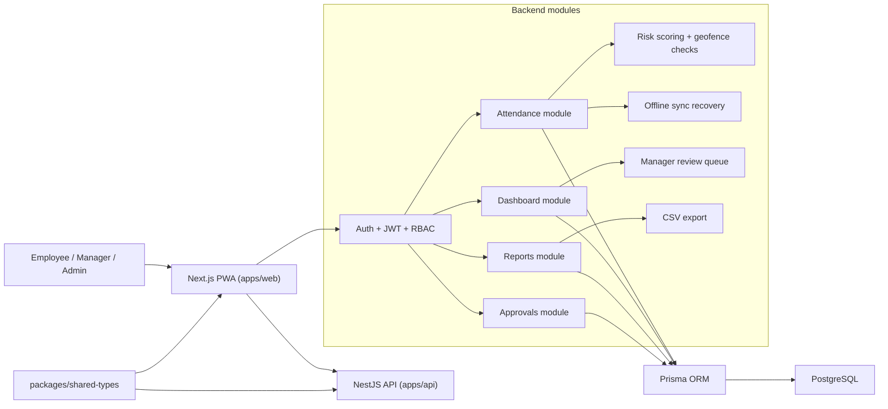
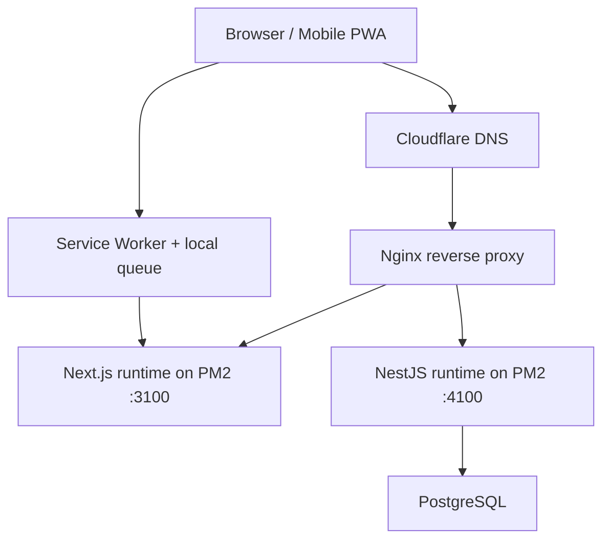

# Smart Attendance PWA

Smart Attendance PWA là monorepo local-first cho bài toán chấm công thông minh theo chi nhánh, gồm:

- frontend PWA bằng Next.js
- backend REST API bằng NestJS
- PostgreSQL qua Prisma
- bộ docs để chạy local, hiểu kiến trúc, và cộng tác theo workflow rõ ràng

## Highlights

- employee check-in/check-out bằng geolocation
- risk scoring cho attendance
- check-in rủi ro cao vẫn được lưu nhưng có thể `chưa ghi nhận`
- dashboard tổng quan cho manager/admin
- manager review queue cho các session cần xem lại
- report attendance và export CSV
- offline queue cơ bản cho attendance request
- PWA install prompt với cooldown khi người dùng đóng banner

## Repo Structure

```text
apps/
  api/          # NestJS API
  web/          # Next.js PWA
packages/
  shared-types/ # shared DTOs/types
docs/           # product, technical, API, DB, workflow docs
scripts/        # local helper scripts
```

## Tech Stack

### Frontend

- Next.js 15
- TypeScript
- Tailwind CSS
- React Hook Form
- Zod

### Backend

- NestJS 11
- Prisma
- PostgreSQL
- Swagger

## Architecture

### System overview



### Runtime and deployment flow



### Key architecture notes

- `apps/web` là lớp PWA cho employee, manager, admin; ưu tiên mobile-first cho luồng chấm công.
- `apps/api` là REST API trung tâm, xử lý auth, attendance, approvals, dashboard và reports.
- `packages/shared-types` giữ DTO/type dùng chung để contract giữa web và API nhất quán hơn.
- Attendance events luôn được lưu trước; nếu risk cao thì session có thể ở trạng thái `chưa ghi nhận` để manager review sau.
- Deploy hiện tại dùng `Nginx` làm reverse proxy cho web và API, còn process app được giữ bởi `PM2`.

## Current Status

### Working now

- auth và RBAC cho `ADMIN`, `MANAGER`, `EMPLOYEE`
- employee attendance flow
- attendance history
- manual correction request
- dashboard summary
- attendance report backend
- CSV export backend
- local-first boot không bắt buộc Docker

### Important current behavior

- check-in không còn bị chặn cứng chỉ vì risk cao
- nếu risk đủ cao, session được lưu với trạng thái `chưa ghi nhận`
- manager/admin sẽ thấy điều này qua dashboard/report

## Local Setup

### Prerequisites

- Node.js
- `pnpm`
- PostgreSQL local đang chạy
- database `smart_attendance`
- user local hiện repo mặc định đang dùng:
  - `mtc_admin`
  - `mtc_secret_2026`

### Install and run

```bash
pnpm install
cp .env.example .env
pnpm check:db
pnpm db:push
pnpm db:seed
pnpm dev:api
pnpm dev:web
```

### Default local URLs

- Web: [http://localhost:3000](http://localhost:3000)
- API: [http://localhost:4000](http://localhost:4000)
- Swagger: [http://localhost:4000/docs](http://localhost:4000/docs)

### Demo accounts

| Role | Email | Password |
|---|---|---|
| Admin | `admin@smart-attendance.com` | `admin123` |
| Manager | `manager1@smart-attendance.com` | `manager123` |
| Employee | `employee1@smart-attendance.com` | `employee123` |

## Useful Commands

```bash
pnpm check:db
pnpm db:push
pnpm db:seed
pnpm dev:api
pnpm dev:web
pnpm test
pnpm typecheck
netlify build
```

## Netlify Deploy

- Repo đã có `netlify.toml` cho frontend Next.js trong monorepo.
- Để deploy dùng được thật, cần cấu hình `NEXT_PUBLIC_API_URL` trỏ tới API public, không phải `localhost`.
- Quy trình tối thiểu:

```bash
netlify link
netlify env:set NEXT_PUBLIC_API_URL https://your-api.example.com/api
netlify env:set NEXT_PUBLIC_APP_URL https://your-site.netlify.app
netlify build
netlify deploy --build
```

- Nếu chỉ deploy web mà API vẫn chạy local, bản Netlify chỉ dùng để xem shell/UI chứ không chạy full flow attendance thực tế.

## Documentation

- [Documentation Hub](./docs/README.md)
- [Current State](./docs/CURRENT_STATE.md)
- [Quick Start](./QUICKSTART.md)
- [Start Here](./START_HERE.md)
- [API Spec](./docs/API_SPEC.md)
- [DB Schema](./docs/DB_SCHEMA.md)
- [UX Flows](./docs/UX_FLOWS.md)
- [Test Plan](./docs/TEST_PLAN.md)
- [Release Guide](./docs/RELEASE.md)
- [Git Workflow](./docs/GIT_WORKFLOW.md)

## Git Workflow

Repo này theo hướng:

- `main` luôn giữ trạng thái có thể demo/chạy được
- làm việc qua branch riêng cho từng thay đổi
- ưu tiên Conventional Commits
- AI-generated code phải được review kỹ trước khi merge
- release branch, tag và deploy flow được mô tả ở [docs/RELEASE.md](./docs/RELEASE.md)

Chi tiết xem tại [docs/GIT_WORKFLOW.md](./docs/GIT_WORKFLOW.md).

## Contributing

Hướng dẫn đóng góp, cách đặt tên branch, commit, PR checklist xem tại [CONTRIBUTING.md](./CONTRIBUTING.md).

## Changelog

Theo dõi mốc thay đổi dự án tại [CHANGELOG.md](./CHANGELOG.md).
